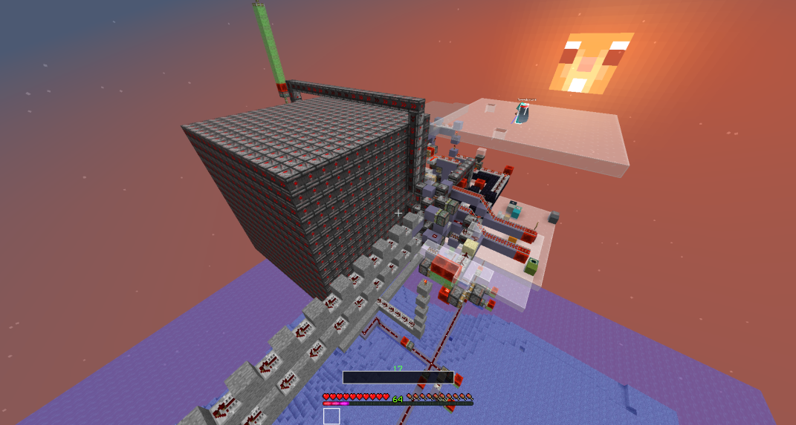
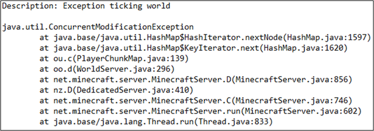
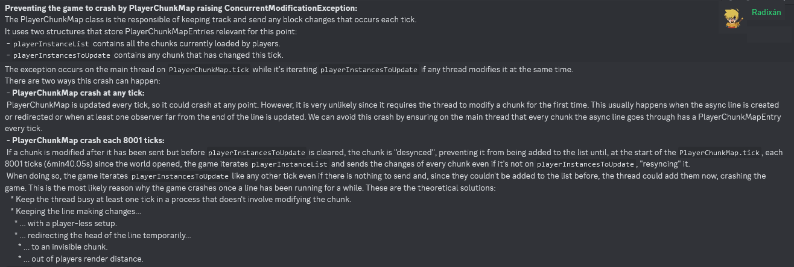

# Async Lines ☆

## Table of Contents

- [Introduction](#introduction)
- [Applications](#applications)
- [Side Effects](#side-effects)
  * [Disabled Packets](#disabled-packets)
  * [Random Palette Corruptions](#random-palette-corruptions)
  * [Server Crashes](#server-crashes)
    + [`ConcurrentModificationException` in the PlayerChunkMap](#CME-PCM)
    + [TickNextTick list ouf of synch crash](#ticknexttick-list-ouf-of-synch-crash)
- [Async Line Death](#async-line-death)
  * [Running Out](#running-out)
  * [Async Thread Crashing](#async-thread-crashing)

# Introduction

An *async line* is a long [update multiplier chain](update-multiplier.md), that has been activated on an [async thread](threads.md#stained-glass-threads).
Usually the update multiplier chain is an observer line.

In an async line one can keep an async thread alive for a long time, while the main thread continues running as normal.
While the async line is running it constantly sends out async block updates which can be used for [threadstone exploits](#applications).

To activate an async line on the async glass thread in survival one needs to perform an [async chunk load](chunk/async-chunk-loading.md).
This async chunk load needs to trigger a [terrain population](chunk/population.md#glass-threads-causing-async-updates).
The terrain population then sends out async block updates which are used to activate the async line.

In [carpet mod](https://github.com/gnembon/carpetmod112/releases) one can for testing purposes create an async line using commands.
The command `/carpet asyncBeaconUpdates true` makes it so that beacons that receive redstone power send out async block updates around them every time they get updated.
The command `/carpet instantScheduling true` turn on [instant tile ticks](global-flags.md#instant-tile-ticks).
One can then create an async line by having a beacon leading into a long chain of observers, and then powering the beacon.
Such an async line looks like this

The further an observer is to the end of the line, the faster it flickers between its powered and unpowered state.

Extending the observer line by one additional observer doubles the lifetime of the async line.

# Applications

The async block updates that an async line sends out can be used for many threadstone exploits, like:

- creating unobtainable blocks with [registry word tearing](word-tearing.md#registry-word-tearing)
- obtaining unobtainable items and falling blocks with [falling block swaps](../falling-block/falling-block-swaps.md)
- creating player heads
- obtaining bedrock items by silk touch mining bedrock created through [hashmap word tearing](word-tearing.md#hashmap-word-tearing)

# Side Effects

## Disabled Packets

If an async line is running in a subchunk for a few seconds, it will often disable all block modification packets from that subchunk.
This means that if a block changes in the subchunk, one will not be able to see it.
One can force the server to send a block modification packet for a particular position if one right clicks the block.
If one wants to see what happens in a subchunk in which an async line is or was running, one needs to right click every block one wants to accurately see.

Block event packets are not disabled, so piston actions will always be visible.

## Random Palette Corruptions
In the subchunks in which an async line is running, blocks can be changed in unexpected ways. Blocks can change through [word tearing](word-tearing.md),
or through random palette corruptions that happen when the palette of a subchunk is upsizing while an async line is running in the subchunk.

A few harmless random palette corruptions are in [this unlisted video](https://www.youtube.com/watch?v=PGmztZCEOAY&list=PL8r-bvM9ltXNkjl7IhGQAHygIPfy2niuC&index=42).

A more extreme random palette corruption happened on the Dugged server in survival. 
An async line suddenly turned all air blocks in a subchunk into observers.

The observers in this subchunk were indestructible, in the sense that whenever you destroyed one of those observers, the resulting air block immediately turned into an observer again.
See angarn's video [Minecraft Concept: Renewable observers in 1.12](https://www.youtube.com/watch?v=boZGqhwcnIk).
This is an instance of blockstate linking. The observers became destructible again after the chunk was reloaded.

## Server Crashes
There are many different ways in which an async line can crash the server, depending on what is being updated at the end of the async line.

The following crashes one can run easily into even if one is careful about what one is updating at the end of the async line.

### `ConcurrentModificationException` in the PlayerChunkMap <a name="CME-PCM"/>

Here is an explanation of this crash by Radixán:

### TickNextTick list ouf of synch crash

There are two different ways in which an async line can cause this crash:

1. ITT gets turned off, maybe even just for a short amount of time, while an async line is running.

If an async line is running while ITT is off, then it will not only quickly run out, but before it quickly runs out it will schedule tile ticks on the async thread.
If the main thread accesses the tile tick list in any way, while the async thread schedules tile ticks, then this can corrupt the tile tick list and cause the above server crash.

2. Fire blocks are loaded, while the async line is using observers, repeaters or comparators.

Fire blocks are the only block in the game that schedules tile ticks, even if ITT is on.
Observers, repeaters and comparators access the tile tick list and check whether tile ticks are scheduled at their positions, even if ITT is on.
If a fire block schedules a tile tick, while an observer, repeater or comparator accesses the tile tick list on the async thread,
this can cause the above server crash.

In the nether this second crash cause is a big problem, because there are a lot of naturally generated fire blocks,
and there is no known way to make a good async line without observers, repeaters or comparators.
So if one wants to use an async line in the nether without crashing the server, one has to remove all fire blocks from all loaded chunks.

A cheaty way to prevent this second cause of the crash is to use the carpet rule `/carpet calmNetherFires true`, which is an optimization rule invented before any threadstone eploits were discovered, and which
stops fire on netherrack from scheduling tile ticks.

# Async Line Death

## Running Out

An async line that is over 40 blocks long theoretically takes weeks to run out.
However it can run out much faster if:
- Blocks from the async lines are broken
- Observers get stuck in a permanently powered state, due to [word resetting](word-tearing.md#word-resetting) or [random palette corruptions](#random-palette-corruptions)
- Chunks get unloaded in such a way that parts of the async line are within 8 blocks of unloaded chunks
- ITT is turned off

## Async Thread Crashing

There are many different ways in which an async thread can crash, depending on what is being updated at the end of the async line.

When nothing is updated at the end of the async line, it can crash in the following ways:
- If the observer chain is several thousand blocks long, it crashes due to a `StackOverflow`.
- If the chunk hashmap is resized, it can do a bad [rehash chunk swap](chunk/async-chunk-loading.md#rehash-chunk-swap) that ends in an `ArrayIndexOutOfBoundsException`.

Other non-obvious ways in which the async line can crash are as follows:
- If the async line updates block 36 while the main thread modifies the tile entity list of the world, then the async thread can crash, because the block update code of block 36 does a completely unnecessary `getBlockEntity` call.

