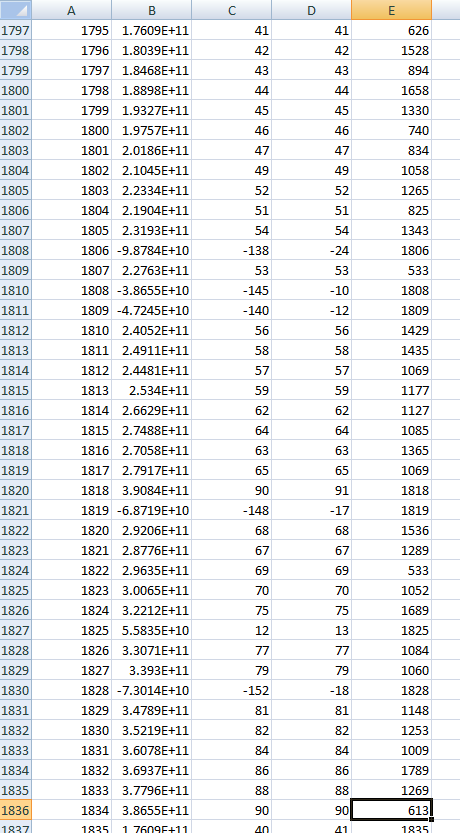

This page is about the chunk hashmap.

# Introduction

In each dimension the loaded chunks are stored in a [`Long2ObjectOpenHashmap`](https://github.com/karussell/fastutil/blob/master/src/it/unimi/dsi/fastutil/longs/Long2ObjectOpenHashMap.java).

In carpet mod one can print out the chunk hashmap using the command `/loadedChunks dump`. The command creates an excel file in the server folder, which looks like this

# Race Conditions
The `Long2ObjectOpenhashmap` is a data structure that does not support asynchronous operations. If multiple threads access the `Long2ObjectOpenhashmap` at the same time, it can fail to work as intended.
In minecraft, the chunk hashmap can be accessed simultaneously by both the [main thread](../threads.md#main-thread) and the [stained glass threads](../threads.md#stained-glass-threads).
This makes many race conditions with the chunk hashmap possible in minecraft.

## Chunk Swaps

## Chunk Linking

Punchster has theorized, that if the async thread upsizes the chunk hashmap, while the main thread unloads a chunk, then additional race conditions can occur that can change the positions of chunks, or link two chunk positions to a single chunk instance.

# Cluster Chunks
An explanation of cluster chunks is in [Falling Block Episode 5, at 3:45](https://www.youtube.com/watch?v=DhohUJiJ1E8&t=225s).

## Applications

