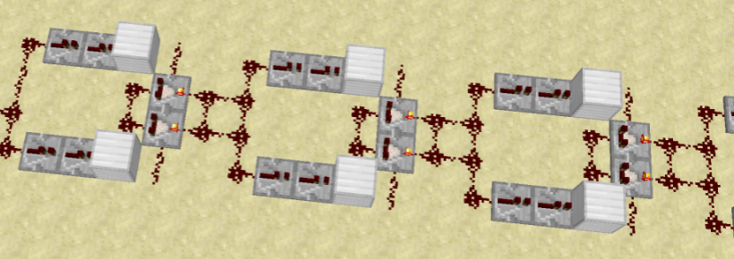
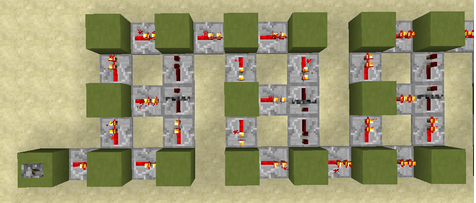

This page is abstractly about update multipliers and concretely about observers on [instant tile ticks](global-flags.md#instant-tile-ticks).

# Introduction

An *update multiplier* is a redstone contraption that detects updates or redstone power changes at its input,
and [immediately](tick-phases.md#immediate-updates) sends out multiple updates or redstone power changes at its output, in such a way that the output could be used to activate a copy of that same update multiplier multiple times.

Update multipliers usually require [instant tile ticks](global-flags.md#instant-tile-ticks) to work.
If ITT is on, then an observer block is an update multiplier, and it is by far the most important kind of update multiplier.

An *update multiplier chain* is a chain of identical update multipliers, where the output of each update multplier is connected to the input of the next update multiplier in the chain.
The number of update multipliers in the chain is called the *length* of the chain.
The number of block updates that get send out at the end of an update multiplier chain increases exponentially with the length of the chain.
This makes long update multiplier chains very laggy, and and activating them causes lag spikes that can last hours, weeks or centuries, during which millions of block updates get send out.
For example a chain of ITT observers of length n, sends out 2^n block updates at the end of the chain, and a chain of 40 observers usually requires several weeks to finish.

# Applications

## Async Lines
When a long update multiplier chain is activated on an async thread it becomes an [async line](async-line.md).

# Non-observer async lines
In the vast majority of circumstances observer chains are the best update multipliers.
But there are also other update multipliers.

When ITT is on, any chain of tile-tick based XOR gates, in which block updates from later XOR gates cannot travel back to earlier XOR gates, is an update multiplier.

There is also a directional update multiplier that uses only repeaters:

One can also keep an async thread alive for roughly one minute in a [tile-tick-less rail-based update multiplier](https://www.youtube.com/watch?v=uVfT5w8RSyQ&list=PL8r-bvM9ltXNkjl7IhGQAHygIPfy2niuC&index=50), 
provided another thread is toggling the [redstone power flag](global-flags.md#redstone-power-flag) very quickly. This kind of async line could in principle work without ITT, but in practice it is difficult to get it to work.

Possible reasons for using non-observer update multipliers are as follows:

- In 1.8 and in skyblock one might not have access to observers, but one might have access to repeaters, and can build the repeater based update multipliers.
- In 1.13 instant tile ticks do not exist, and one needs to use a rail-based async line to keep async threads alive.
- If a good async line without observers, repeaters and comparators were found, it would make it possible to run async lines in the nether and have fire blocks loaded without crashing the game.
